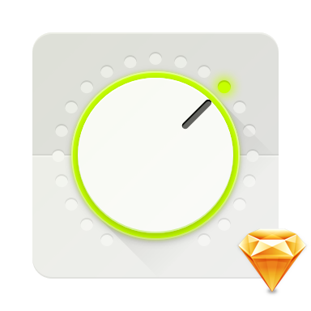
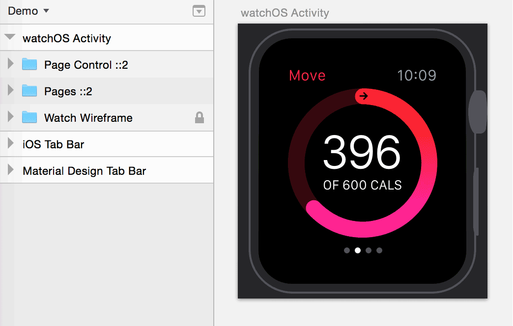

# State Machine

State Machine is a Sketch plugin. Installing it will allow you to use ⌃⌘S to switch an active tab on a tab bar you’re designing, an active navigation section in a menu, or a page number in a pagination control.

#### Read more

* [In english]
* [По-русски]

[In english]: https://medium.com/@romanshamin/3337b8776b49
[По-русски]: https://medium.com/@romanshamin/bb453f46a788

### Install

1. Download and unzip: [State-Machine-v1.0.sketchplugin.zip].
2. Open Sketch.app, go to `Plugins → Reveal Plugins Folder...` and add `State-Machine.sketchplugin` there.

[State-Machine-v1.0.sketchplugin.zip]: https://cdn.rawgit.com/romashamin/statemachine-sketch/master/State-Machine-v1.0.sketchplugin.zip

### System Requirements

State Machine has been tested on Sketch 3.3.3 on OS X Yosemite. If you have any problems, drop me a line: [@romanshamin].

[@romanshamin]: https://twitter.com/romanshamin

### Satisfied Pro?

If you’re a professional web designer or developer and State Machine saves your time, buy me a cup of pu-erh tea to say ‘thanks’: [pay $3 by PayPal]

### Roadmap

* Switching styles for two-element components
* Passing a layer id into a few components

### Thanks

